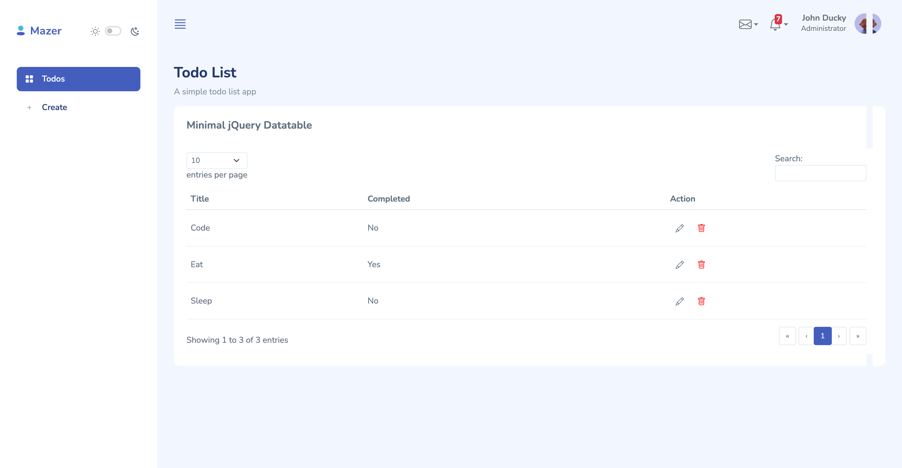
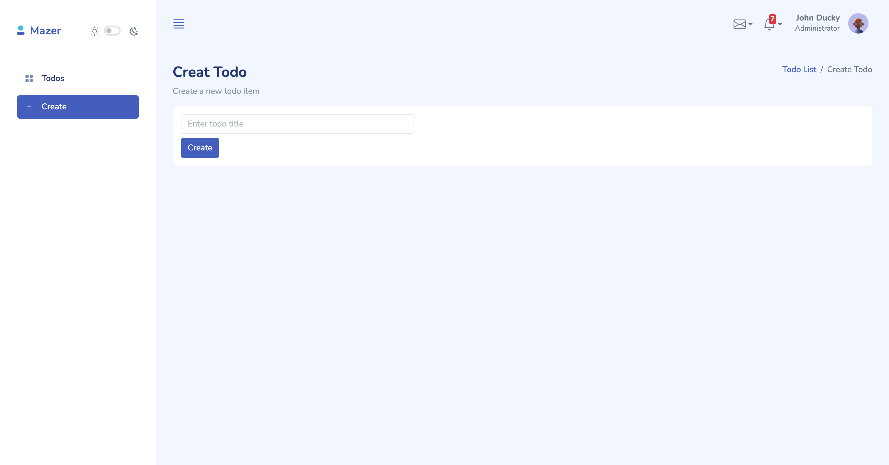
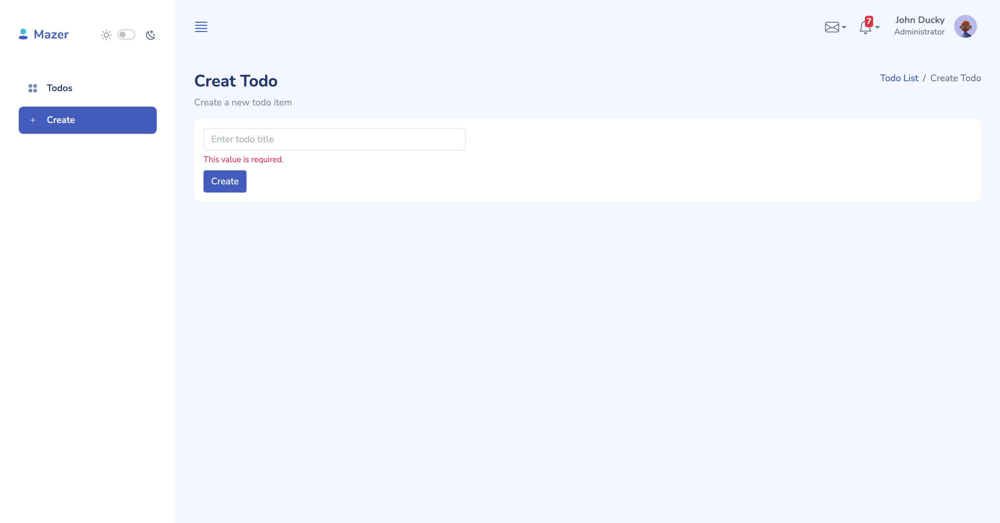
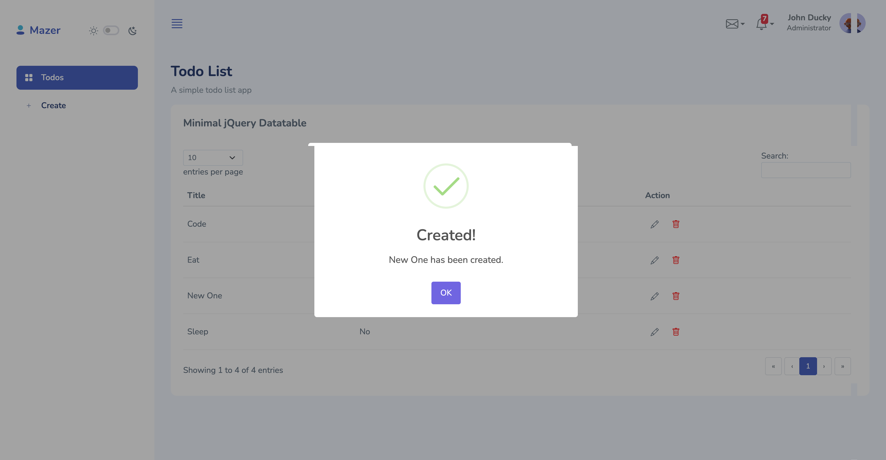
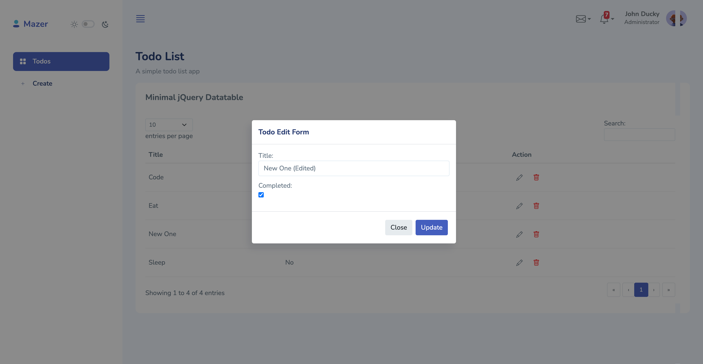
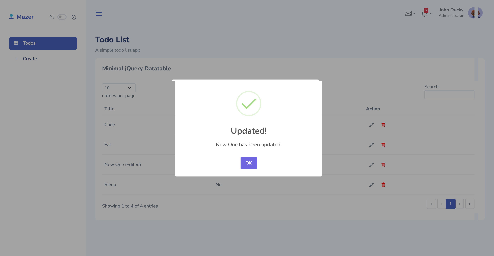
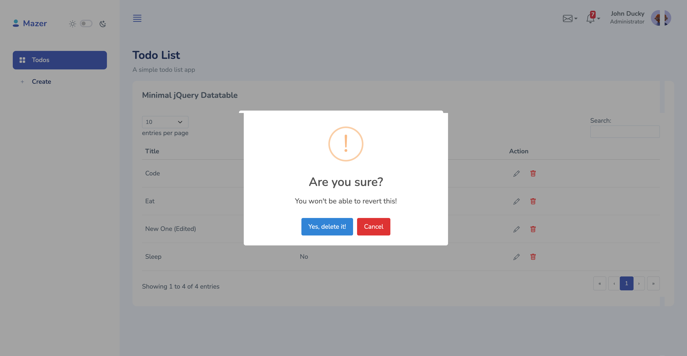
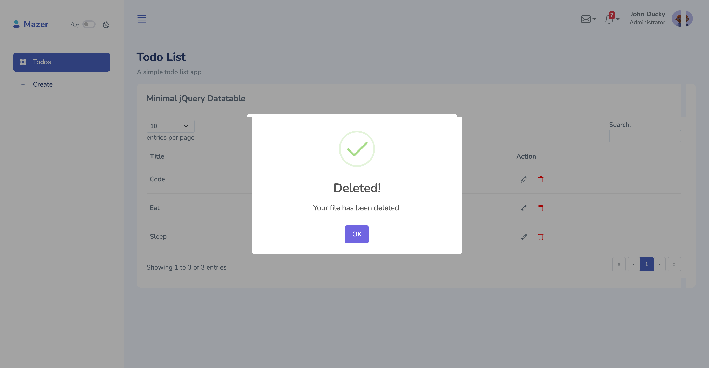

# django-inertia-todo

This is a sample todo application built with Django and Inertia.js. The app showcases how to create, read, update, and delete tasks in a modern web application while leveraging the benefits of both Django as a backend framework and Inertia.js for a seamless frontend experience.

## Why Inertia.js?

Inertia.js is a powerful tool that enables developers to build single-page applications (SPAs) using classic server-side frameworks like Django. Here are some key reasons to use Inertia.js in this project:

- Simplicity: Inertia.js allows developers to build SPAs without having to deal with the complexity of client-side routing. It uses standard server-side routing, making it easier to transition from traditional web applications to SPAs.

- Improved User Experience: By leveraging Inertia.js, we can provide a fast, fluid user experience without full-page reloads. This results in quicker interactions and a more app-like feel.

- Minimal JavaScript: Inertia.js allows us to write less JavaScript code while still achieving dynamic interactivity. This is particularly beneficial for teams that want to maintain a focus on backend development.

- Integration with Modern Frameworks: Inertia.js works seamlessly with popular JavaScript frameworks like Vue.js, React, and Svelte. This application uses [your choice of framework here], making it easy to create a responsive UI.

## Screenshots

Todo List page:

Todo Create:

Todo Create (Error):

Todo Create (Success):

Todo Update Modal:

Todo Update Success:

Todo Delete Modal:

Todo Delete Success:
